# **Tetris-Combat | WebGame**

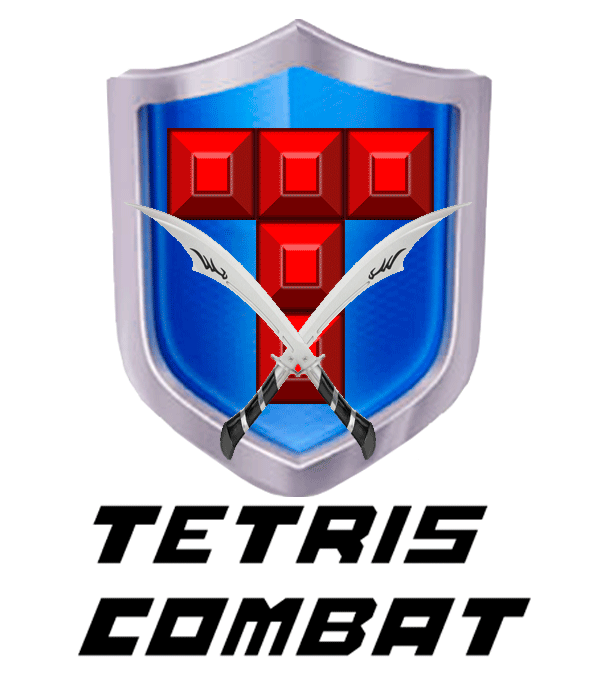

## **Información**

### **Materia**

> ARSW - Arquitectura de Software

### **Profesor**

> Diego Alfonso Prieto Torres

### **Integrantes**

>```bash
>- Nicolás Cárdenas Chaparro
>- David Antonio Diaz Duarte
>- Pedro José Mayorga Navarrete
>```

## Trailer

https://www.youtube.com/watch?v=zS63gjg1Yzs

## **Despliegue en Heroku**

[](https://tetris-combat2.herokuapp.com/)

**Enlace:** [`tetris-combat2.herokuapp.com`](https://tetris-combat2.herokuapp.com/)

## **Resumen**

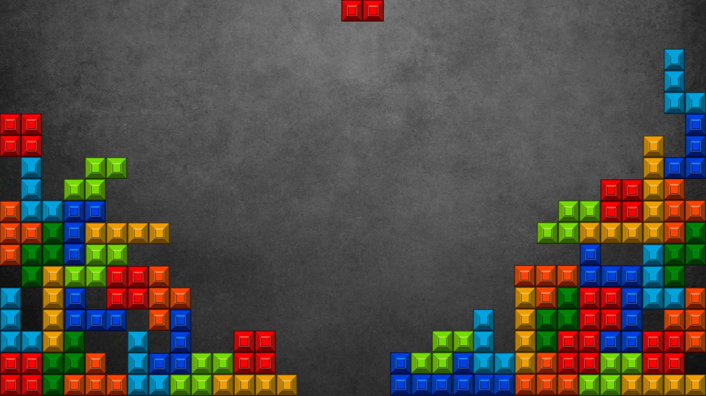

**Tetris-Combat** es un juego **multijugador** en tiempo real basado en el juego original diseñado en `1984` por `Alekséi Pázhitnov`. El juego administra una base de usuarios que se registran para jugar en salas creadas por ellos mismos donde podrán encontrarse y jugar con amigos. Adicionalmente, cada usuario podrá consultar las estadísticas de su perfil, partidas jugadas y cuenta.

## **Descripción**

### **Tetris**

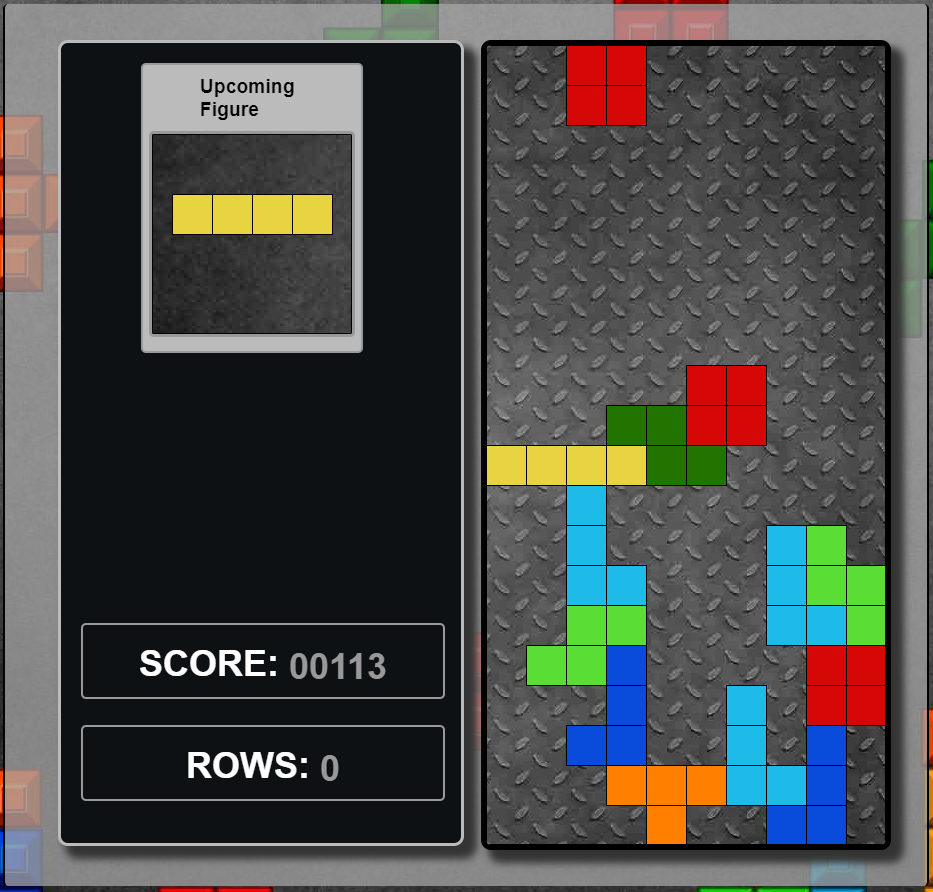

En el Tetris se juega con los tetrominós, que son figuras creadas por la combinación de 4 cuadrados de igual dimensión.

Son 7 figuras las generadas por las combinaciones existentes de tetrominós y son estas las que comienzan a caer una por una en el tablero de juego mientras el jugador puede puede decidir la rotación de la pieza mientras cae (0°, 90°, 180°, 270°), así cómo en qué lugar debe caer.

Cuando una línea horizontal se completa, esa línea desaparece (generando una puntuación extra al jugador) y todas las piezas que están por encima descienden una posición, liberando espacio de juego y por tanto facilitando la tarea de situar nuevas piezas.

La caída de las piezas se acelera progresivamente. El juego acaba cuando las piezas se amontonan hasta llegar a lo más alto, interfiriendo la creación de más piezas y finalizando el juego.

### **Interfaz Gráfica**

La interfaz gráfica del juego se encontra dividida en 2 partes diferenciales en las que se divide el aplicativo.

- **Aplicación Web:**

  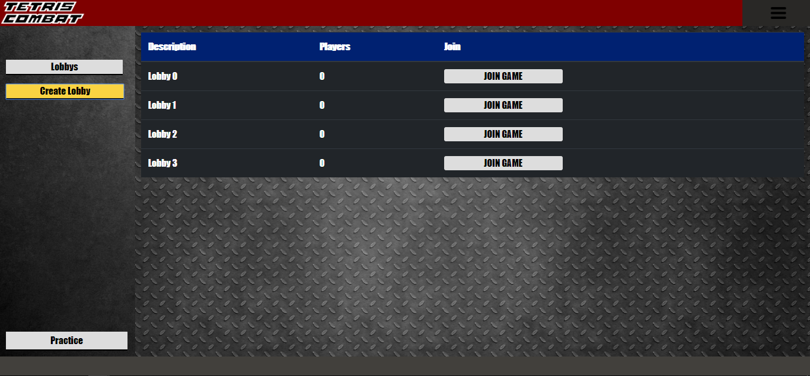

  Basados en guías de desarrollo responsivo, se ha diseñado una interfaz amigable con el usuario, con una baja curva de aprendizaje que le permita reconocer fácilmente las funcionalidades de la aplicación en sus respectivos menús.

- **Juego:**

  
  
  Al ser el juego multijugador, se decidió que la manera más amigable de realizar la visualización de una partida era con un máximo de 2 jugadores por sala, de manera que el juego consistiera en el enfrentamiento o `combate` entre dos jugadores para facilitar la competitividad y evitar problemas cómo distracciones excesivas en el desarrollo de una partida.

  Por esta razón la interfaz del juego cuenta con dos tableros funcionales, el primero (ubicado al costado izquierdo) muestra la partida del jugador local en un primer plano, mientras que a la derecha se muestra la partida de su `rival` un poco más pequeña, lo que permite darle prioridad a su juego actual sin dejar de estar al tanto de su oponente.

### **Modos de Juego**

Actualmente el juego dispone de 2 modos de juego:

- **Un Jugador:**

  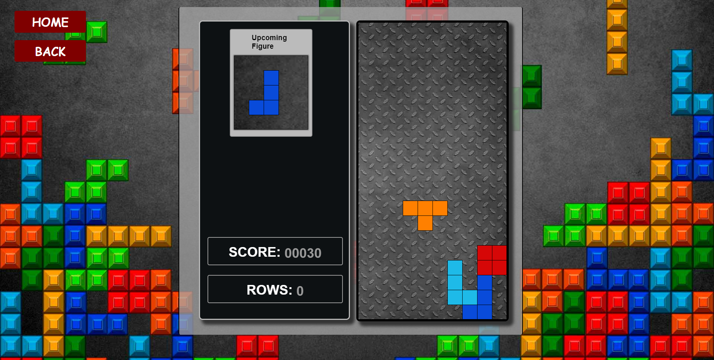

  En este modo de juego, el jugador no tendrá rival y jugará solo buscando conseguir la mayor cantidad de puntos sin que se se acabe el juego.

- **Multijugador**

  

  En este modo de juego, el jugador competirá contra otro rival en una partida a `tiempo real` donde ganará el jugador que resista más tiempo en el tablero de juego sin perder.

### **Salas**


Las Salas de juego componen el lugar de encuentro donde se crean y posteriormente se realizan las partidas multijugador entre dos jugadores. Implementadas mediante el uso de sockets, le permiten a cualquier jugador la opción de crear una de estas para poder inivitar y jugar con amigos, a la vez que ofrecen la posibilidad de unirse a una partida ya creada anteriormente por otro usuario.

### **Perfil**

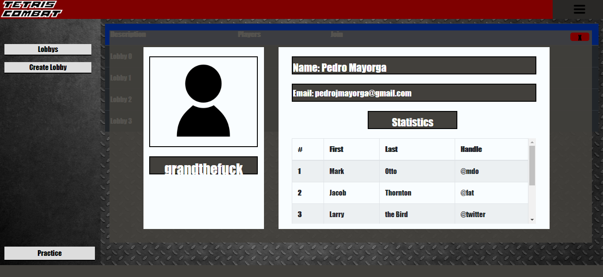

Cada jugador deberá registrarse en la Aplicación para poder empezar a jugar, de tal manera que pueda tener acceso a todas las funcionalidades del juego, además de las estadisticas y opciones de usuario que tendrá disponibles.

## **Reglas del Juego**

### **Mecanicas del juego**

El juego consiste de 7 piezas generadas aleatoreamente que comienzan a caer una por una en el tablero de juego mientras el jugador puede puede decidir la rotación de la pieza mientras cae (0°, 90°, 180°, 270°), así cómo en qué lugar debe caer.

Cuando una línea horizontal se completa, esa línea desaparece y todas las piezas que están por encima descienden una posición, liberando espacio de juego y por tanto facilitando la tarea de situar nuevas piezas.

### **Fin del Juego**

El juego acaba cuando las piezas se amontonan hasta llegar a lo más alto, impidiendo la creación de más piezas y finalizando el juego.

### **Ganar Partida**

En el modo `"un jugador"` la partida es infinita hasta que el propio jugador pierda, sin embargo en el modo `"multijugador"` un jugador ganará la partida si el jugador rival pierde la partida.

Igualmente, en la partida por tiempo, ganará quién al finalizar el tiempo de la misma tenga la mayor cantidad de puntos.

### **Controles**

| Tecla       | Función                   |
| ----------- | ------------              |
| `↑`         | Rotar Pieza               |
| `↓`         | Bajar Pieza Rápidamente   |
| `→`         | Mover Pieza a la Derecha  |
| `←`         | Mover Pieza a la Izquierda|
| `SPACE`     | Iniciar Juego             |
| `ESC`       | Pausar Juego              |

### **Puntuación**

- A medida que el tiempo va pasando se va agregando una puntuación al jugador automáticamente.
- Cuando una línea horizontal se completa, esa línea desaparece y genera una puntuación extra al jugador.
- Si dos o más lineas horizontales se completan al tiempo se generará un multiplicador de esa puntuación por el número de lineas completadas al tiempo.

### **Poderes** (posible)

    Vidas (posible)
    Destruir Rango (posible)

### **Tablero de Juego** (construyendo)


El Tablero de Juego se compone de una region vacia donde las fichas van bajando a medida que el tiempo avanza, se muestran además estadisticas propias de la partida, como la puntuación, el nombre del jugador y el tiempo de juego restante de la partida.

### **Piezas de Juego**

| Nombre      | Description   | Imagen        |
| ----------- | ------------- | ------------- |
| Pieza 1     | Cuadrado      |         |
| Pieza 2     | Palo          | |
| Pieza 3     | "T"           | |
| Pieza 4     | "L" normal    | 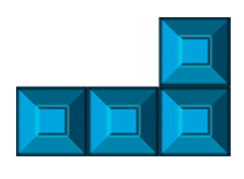|
| Pieza 5     | "L" invertida | 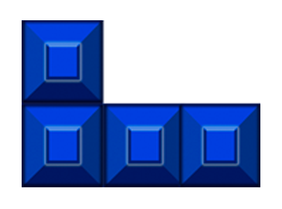|
| Pieza 6     | "S" normal    | 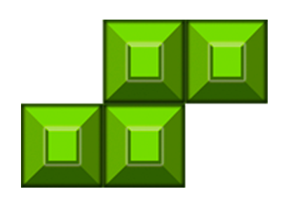|
| Pieza 7     | "S" invertida | 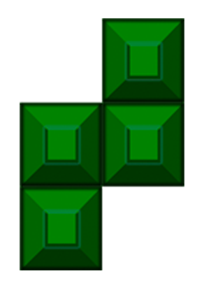|

## **Funcionalidades**

### **Registro**

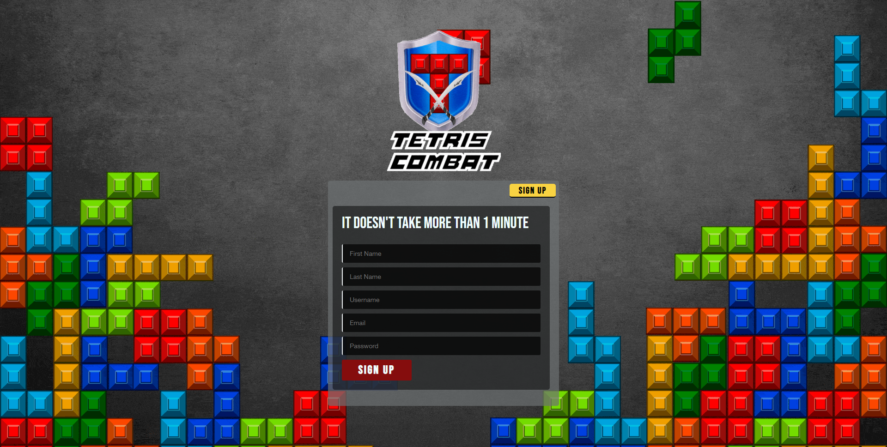

El Registro al juego incluye la inscripción de un usuario nuevo de la aplicación con sus datos de usuario:

- Nombre
- Apellido
- Username
- Correo
- Contraseña

### **Inicio de Sesión**

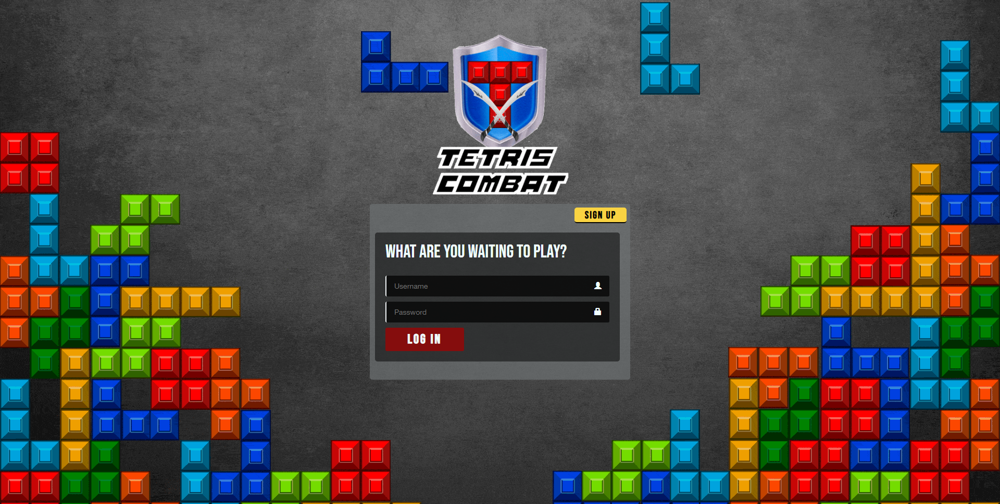

El Inicio de Sesión le permite a un jugador ya registrado ingresar para comenzar a jugar partidas de juego.

### **Crear Sala**


El Crear Sala le permite a un jugador crear una sala de juego nueva para jugar con otras personas.

### **Practicar**


La funcionalidad de `Practicar` le permite a un jugador "practicar" antes de entrar a una partida con otra persona.

### **Unirse a Partida**

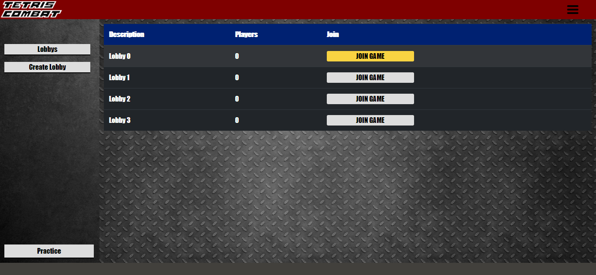

La funcionalidad de `Unirse a Partida` le permite a un jugador unirse a una sesión de juego ya creada con anterioridad.

### **Inicio de Partida**


La funcionalidad de `Inicio de Partida` le permite a un jugador empezar a jugar contra un rival en el modo multijugador.
  
### **Fin de Partida** (construyendo)

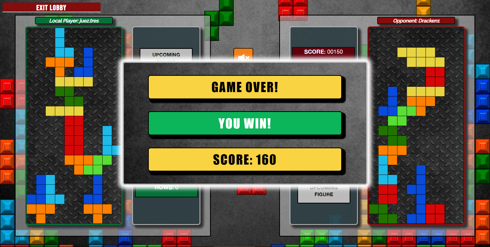

La funcionalidad de `Fin de Partida` se muestra cuando uno de los dos jugadores pierde en el modo multijugador.

### **Menu Opciones**

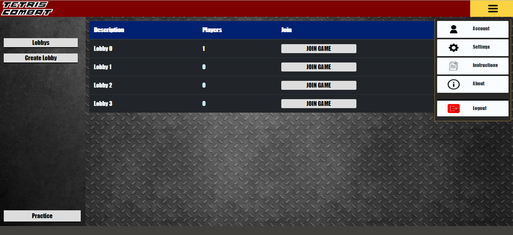

La funcionalidad de `Menu de Opciones` le permite a un usuario acceder a otras funcionalidades extendidas de la aplicación.

### **Perfil de Usuario**


La funcionalidad de `Perfil de Usuario` le permite a un usuario acceder a un resumen de su Perfil, que incluye estadísticas de su uso de la aplicación.

### **Instrucciones**

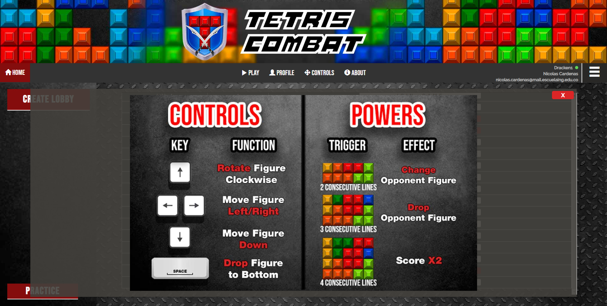

La funcionalidad de `Instrucciones` le muestra a los usuarios, cuales son los controles que tiene el juego y cómo poder jugarlo.

### **Acerca De** (en construccion)

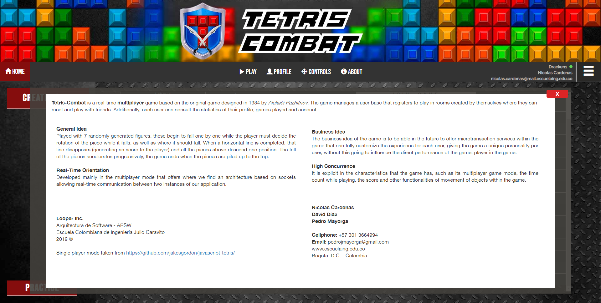

La funcionalidad de `Acerca De` le muestra a los usuarios información sobre la aplicación, su contrucción y documentación.

### **Cerrar Sesión**

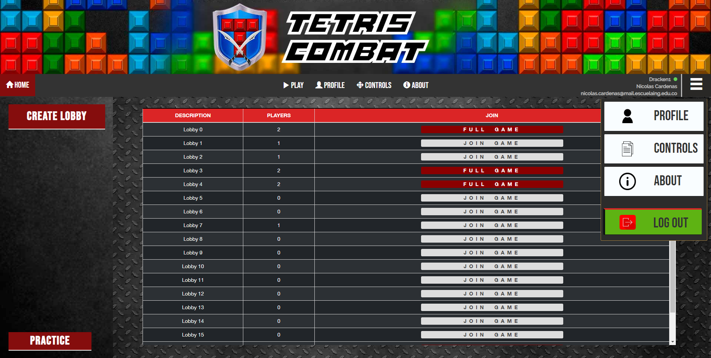

La funcionalidad de `Cerrar Sesión` le permite a un usuario desloggearse y salir exitosamente de la aplicación.

# Atributos no funcionales 
## Escenarios 
### Usabilidad
1.Escenario de juego (Jugadas oponente)
- Estimulo: Durante la partida
- Fuente: Usuarios
- Artefacto: Frontend, backend
- Ambiente: Condiciones normales de ejecución 
- Tiempo de respuesta:  Respuestas de menos de un segundo

2. Abandono de partidas (Control de abandono)
- Estimulo: Abandono de partida mediante botón de salida, o cierre de navegador
- Fuente: Usuarios
- Artefacto: Frontend, backend
- Ambiente: Condiciones normales de ejecución.
- Tiempo de respuesta:  Respuestas de menos de un segundo


### Escalabilidad
1. Vertical
- Estimulo: Al momento de jugar 
- Fuente: Usuarios
- Artefacto: Frontend, backend 
- Ambiente: Condiciones de alta demanda

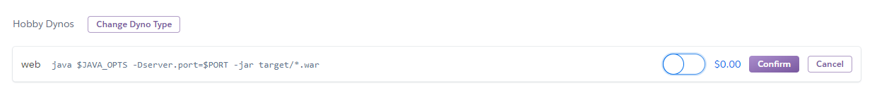

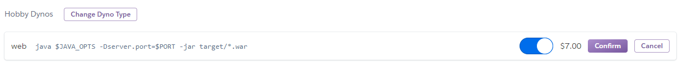

2.Horizontal 
- Estimulo: Al momento de jugar
- Fuente: Usuarios
- Artefacto: Backend
- Ambiente: Sobrecarga de usuarios
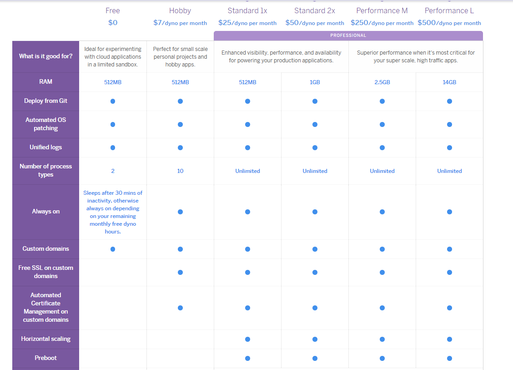

### Performance 
1. Real-time
- Estimulo: Creacion de lobbys, inicio de partidas, juego, cierre de partidas
- Fuente: Usuarios
- Artefacto: Frontend
- Ambiente: Condiciones normales de ejecución
- Tiempo de respuesta:  Respuestas de menos de un segundo

2.Tiempos de respuesta 
- Estimulo: Clic en diferentes botones alrededor del juego
- Fuente: Usuarios
- Artefacto: Backend 
- Ambiente: Condiciones normales de ejecución
- Tiempo de respuesta:  Respuestas de menos de un segundo

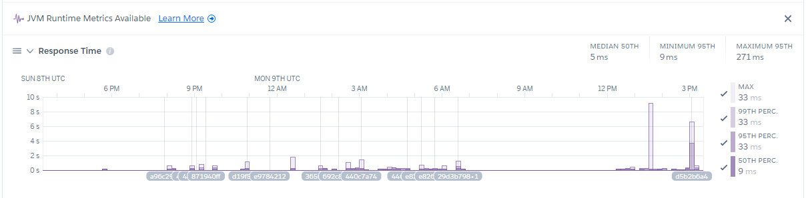

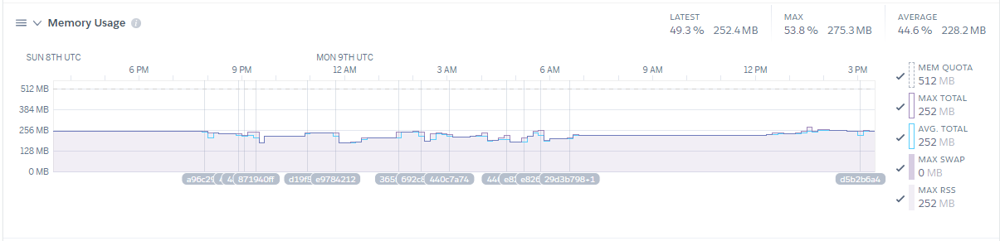


## **Requerimientos**

### **Idea General**


La base del juego es la idea original del juego original diseñado en `1984` por `Alekséi Pázhitnov`.

En el Tetris se juega con los tetrominós, el caso especial de cuatro elementos de poliominós. Los poliominós se han utilizado en los rompecabezas populares por lo menos desde 1907, y el nombre fue dado por el matemático Solomon W. Golomb en 1953. Sin embargo, incluso la enumeración de los pentominós data de la antigüedad.

El valor añadido que tiene nuestro juego en comparación a otros se basa en sus requerimientos no colaborativos donde encontramos por ejemplo el mdoo multijugador.
  
### **Business Idea**


La idea de negocio que tiene el juego es poder a futuro ofrecer servicios de microtransacciones dentro del juego que puedan personalizar la experiencia completamente para cada usuario, dotando el juego de una personalidad única por usuario, sin que esto vaya a influir en el desempeño directo del jugador en el juego.

Igualmente, se buscaría tambien ofrecer publicidad dentro del juego tomando en cuenta una base de usuarios considerable, que no sea intrusiva y sobretodo que sea especifica para cada jugador.

### **Orientación en Tiempo Real**

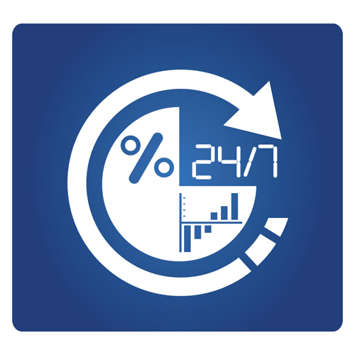

La Orientación en tiempo real del juego se desarrolla principalmente en el modo multijugador que ofrece donde encontramos una arquitectura basada en sockets permitiendonos la comunicación en tiempo real entre dos instancias de nuestra aplicación.

Esto nos permite realizar una conexión más que estable entre el jugador local y su oponente, de manera que el rendimiento del juego no se vea impactado por un número significativo de conexiónes al tiempo.

### **Alta Concurrencia**


La Alta Concurrencia de la aplicación se encuentra explicita en las caracteristicas que tiene el juego, como su modo de juego multijugador, el conteo del tiempo mientras se juega, la puntuación y demás funcionalidades de movimiento de objetos dentro del juego.


### Memoria


La memoria se mantuvo casi constante durante toda la prueba.

### Tiempo de respuesta


Los tiempos de respuesta son menores a 1 segundo en la mayoría de los casos dependiendo de la velocidad de internet de cada uno de los usuarios.

## **Casos de uso**

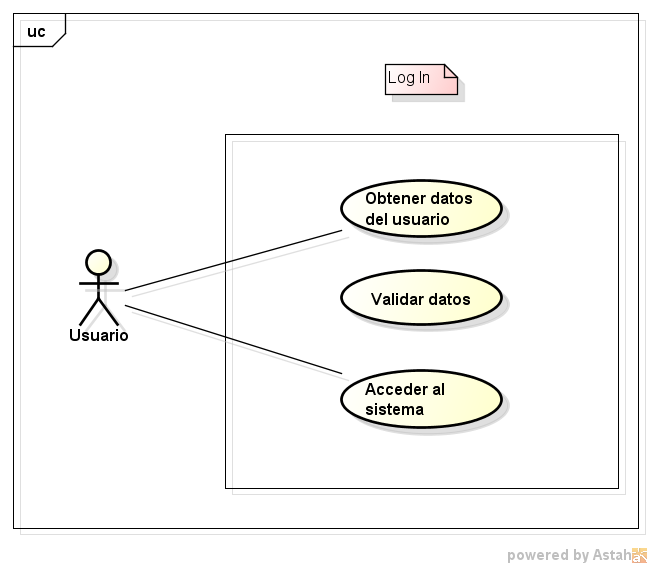


## **Diagrama de componentes**

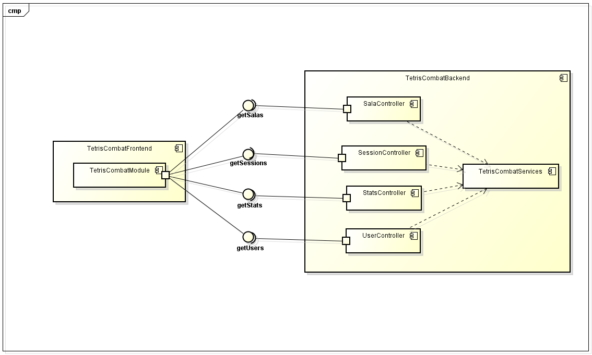

## **Diagrama de despliegue**

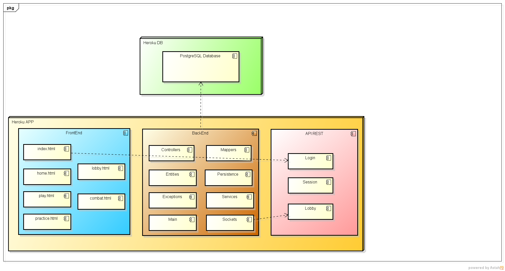

## **Diagrama Entidad-Relación**

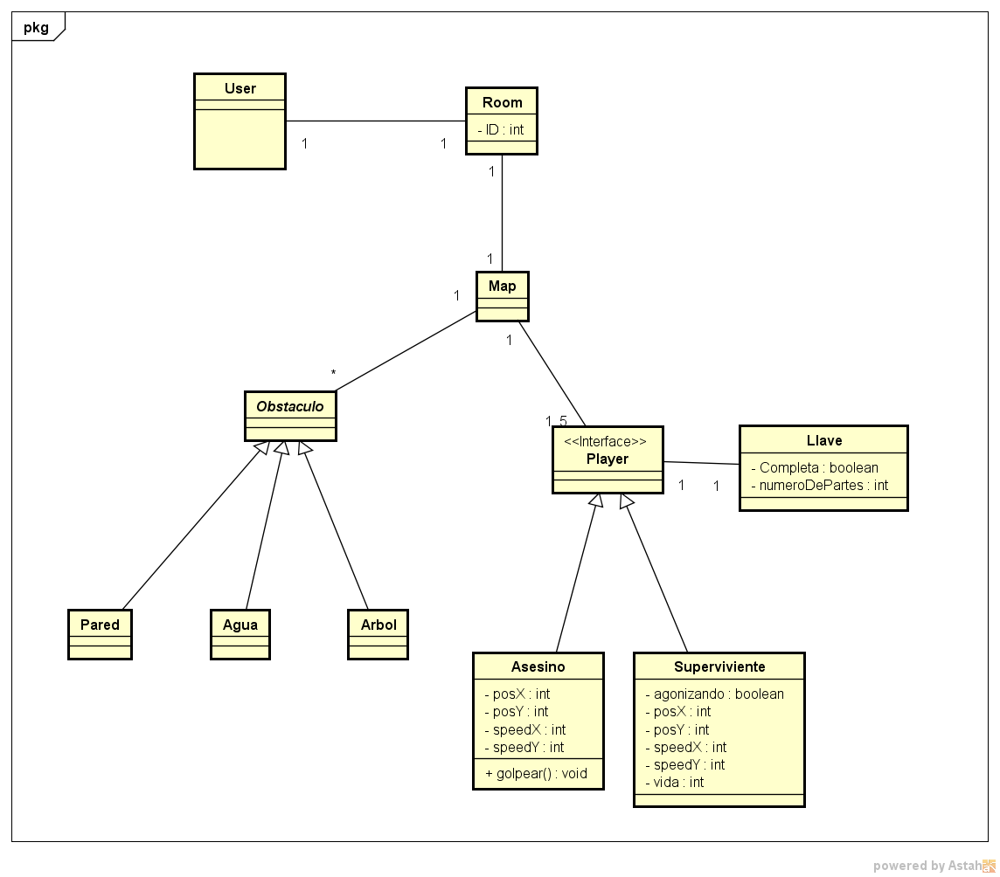


